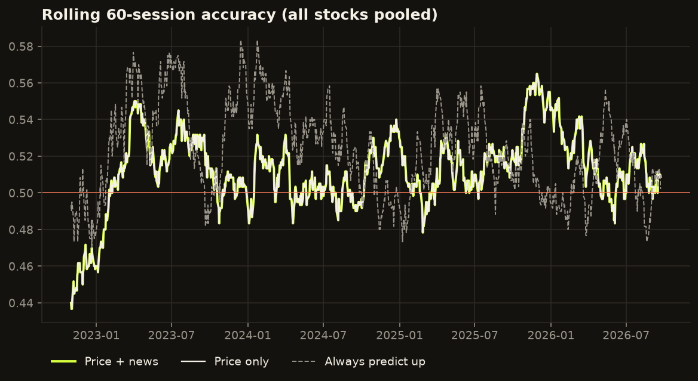

# Stock prediction lab

**A self-updating quant experiment. Every weekday it asks two questions about the US stocks you choose: will each one rise in the next session, and will it beat the market? Competing models answer from prices, news, earnings, analysts, options, macro data and social media. The bot learns from every right and wrong call, checks that its probabilities are honest, and paper-trades the best model's picks with real fills. It publishes the full track record, including when it's no better than a coin flip.**

> Educational project, not financial advice. It never touches real money: orders only ever go to an Alpaca *paper* (simulated) account.

## Live scoreboard

<!-- scoreboard:start -->
**Updated:** 2026-09-24 15:30 UTC

### Next-session calls

Will each stock close above its opening price in the next session? Calls use the **champion**: whichever of the four models was most accurate over the last 120 sessions (now: gradient boosting). **Buy at open** marks the (up to) 3 highest-rated stocks with P(up) ≥ 52%: the paper-trading strategy.

No open calls right now. New ones are made after each US market close.

### Which model is winning?

| Model | Accuracy, last 120 sessions |
|---|---|
| **Gradient boosting (champion)** | 53.0% |
| Logistic, price + news | 50.3% |
| Logistic, price only | 50.3% |
| Ensemble | 49.2% |

### How accurate has it been?

| | Predictions | Accuracy | 95% range | Always up | Same as today | Beats baselines? |
|---|---|---|---|---|---|---|
| Historical replay, logistic, price + news | 10,338 | **51.0%** | 50.0%–51.9% | 52.2% | 49.8% | no |
| Historical replay, logistic, price only | 10,338 | **51.0%** | 50.0%–51.9% | 52.2% | 49.8% | no |
| Historical replay, gradient boosting | 9,748 | **51.2%** | 50.2%–52.2% | 52.3% | 49.8% | no |
| Historical replay, ensemble | 9,748 | **51.2%** | 50.2%–52.2% | 52.3% | 49.8% | no |

Any model has to beat three simple rules: always predict up (*Always up* is the share of sessions that rose), always predict down, and predict the same direction as today (*Same as today*). *Beats baselines* is only "yes" when the whole 95% range is above all three.



Full report, with per-stock results, paper trading and source health: [reports/latest.md](reports/latest.md)
<!-- scoreboard:end -->

## How it works

Every weekday after the US market closes, GitHub Actions runs `python -m stocklab daily`, which:

1. **Collects** today's prices, headlines, filings, earnings dates, analyst actions, options data, macro data and social posts from every source below.
2. **Scores yesterday.** Each earlier prediction is checked against how that session actually went.
3. **Learns.** The online models are updated with the inputs they used and the real outcome. The update is proportional to the error, so a confident wrong call (say 90% "up" on a day the stock fell) changes the model about 9× more than a confident right one: **wrong predictions are the biggest lessons.** Gradient boosting is retrained on every finished session.
4. **Predicts the next session** for every stock with every model, and makes the calls with each question's recent **champion**.
5. **Trades on paper.** Before the next open, the champion's top picks are sent to an Alpaca paper account as market-on-open buys, and sold with market-on-close orders. That evening the real fills are recorded next to the predictions.
6. **Publishes** the calls, accuracy, calibration and charts to this README and [`reports/latest.md`](reports/latest.md), then commits every prediction, headline and model weight to the repo.

The first time it sees a stock, it replays about 4 years of that stock's history through the same predict → score → learn loop, so each model starts with experience rather than from zero. When a model's inputs change (for example a new data source), it is rebuilt from history the same way. Real live predictions are never rewritten.

## Two questions

| Question | Scored as correct when… | Why ask it |
|---|---|---|
| **Up or down?** | the stock closes above its open (next session) | The direct trading question: buy at the open, sell at the close. |
| **Beats the market?** | the stock's open → close return beats SPY's over the same session | It removes the market's own move, the biggest and least predictable part of any stock's day. The trade is market-neutral: buy the picks, short the same amount of SPY. |

## Data sources

| Source | What it provides | History? | Needs |
|---|---|---|---|
| Yahoo Finance (`yfinance`) | Daily open, high, low, close and volume for each stock and SPY | yes | nothing |
| Yahoo Finance (`yfinance`) | **Earnings calendar**: report dates and EPS surprise vs analysts' estimate | yes | nothing |
| Yahoo Finance (`yfinance`) | **Analyst revisions**: upgrades, downgrades and price-target changes | yes | nothing |
| Yahoo Finance (`yfinance`) | **Options-implied volatility** and put/call volume from the option chain | live only | nothing |
| FRED (St. Louis Fed) | **Macro**: VIX, 10-year Treasury yield, 10-year minus 2-year yield curve | yes | nothing |
| SEC EDGAR | 8-K filings, which companies must file for material events | yes | `SEC_USER_AGENT` (your name and email, SEC policy) |
| Yahoo Finance RSS, Google News RSS | Latest headlines for each stock | live only | nothing |
| Finnhub | Company news | live only | `FINNHUB_API_KEY` (free tier) |
| StockTwits | Recent posts, tagged bullish or bearish by their authors | live only | nothing |
| Reddit | Posts mentioning the stock in r/wallstreetbets, r/stocks, r/investing, r/StockMarket | live only | `REDDIT_CLIENT_ID` + `REDDIT_CLIENT_SECRET` (free "script" app) |
| Alpaca | Paper-trading orders and their real fills | – | `ALPACA_API_KEY` + `ALPACA_SECRET_KEY` (free paper account) |

*History?* matters: sources with history are rebuilt for every past day, so the models learn them from four years of data. Live-only sources can't be looked up for the past. They count as *unknown* on historical days, and the bot saves them every evening (in [`state/live_features.csv`](state/live_features.csv)) so they build a history of their own.

Sources without their key are skipped automatically. Any source that fails on a given day is logged in the report and skipped, so one broken feed never stops the run. To test your keys, run **Actions → check sources**: it calls every source once and prints what came back.

### No peeking at the future

Every feature only uses what was public by the evening run:

- An **earnings report** counts as "coming up" only between the previous close and the reacting session's close. Its surprise is used only after the release time.
- **Analyst actions** count only if they were published before 17:00 New York time.
- **FRED values** are used from the *previous* day, because FRED publishes each day's value the next morning.

The tests check each of these rules.

## What the models look at

| Group | Features |
|---|---|
| **Price** (known at today's close) | returns over 1, 5 and 20 days · 20-day volatility · RSI · distance from the 50-day average · volume vs normal · overnight gap · today's open → close move · market (SPY) returns |
| **Company events** | earnings before the next close? · days since the last report · last EPS surprise · analyst upgrades minus downgrades (30 days) · average price-target revision (30 days) · 8-K filings (5 days) |
| **Macro** | VIX and its weekly change · weekly change in the 10-year yield · yield curve |
| **Headlines** | average sentiment (24 h) · number of headlines · 3-day sentiment trend · any news at all? |
| **Options and social** | at-the-money implied volatility · implied vs realised volatility · put/call volume · number of social posts · social mood |

## Headline sentiment: VADER vs FinBERT

Every headline is scored twice:

- **VADER** is a fast word-list scorer, with an added finance vocabulary ("beats", "downgrade", "recall", "lawsuit"…).
- **FinBERT** (`ProsusAI/finbert`) is a BERT language model fine-tuned on financial news. It reads the whole sentence, so it handles "beats on revenue but cuts guidance" or "shares fall less than feared" better. It needs PyTorch and a 440 MB model, which the daily workflow installs and caches.

They are compared live in two ways:

1. **Two otherwise identical models**, *Logistic, all sources (VADER)* and *Logistic, all sources (FinBERT)*, go head to head. Their historical results are identical (there are no past headlines), so any difference in live accuracy comes from the sentiment scorer.
2. **Directly:** on the days a scorer read the mood as clearly positive or negative, how often did the next session go that way? This is in the report.

## The models

| Model | How it works | Answers |
|---|---|---|
| **Logistic, all sources (VADER)** | Online logistic regression, one per stock, updated after every session, using every feature. | both questions |
| **Logistic, all sources (FinBERT)** | The same, with FinBERT headline sentiment instead of VADER. | up or down |
| **Logistic, price only** | The same model with price features only. | up or down |
| **Gradient boosting** | Hundreds of small decision trees (`HistGradientBoostingClassifier`), trained on all watched stocks pooled together and retrained every session, using every feature with history. | both questions |
| **Ensemble** | The average of the VADER logistic model and gradient boosting. | both questions |

*Logistic, price only* is the control: it shows whether the extra data actually helps, rather than assuming it does.

**The champion makes the calls.** For each question, whichever model was most accurate over the last 120 sessions makes tonight's calls, so the bot switches to a better model automatically when one starts winning.

## Are the probabilities honest? (calibration)

A model that says "60% up" should be right about 60% of the time on those calls. The report groups every model's predictions by confidence (under 40%, 40–45%, …, 60% or more) and compares each group's predicted chance with how often it actually happened. The **average gap** (expected calibration error) sums this up in percentage points. The README shows the up/down champion's table; [the full report](reports/latest.md) shows every model and a calibration chart. Once a model has 300 live predictions, only live ones are used.

A well-calibrated 53% is worth more than an over-confident 60%. Calibration is also why the paper-trading threshold is modest (52% by default).

## Paper trading

**Simulated from prices (every model, since the start of history).** Each session, rank the stocks by a model's probability and take the top 3 with P ≥ 52%, paying 5 bp per trade:

- **Up or down:** buy them at the open and sell at the close.
- **Beats the market:** buy them and short the same amount of SPY. This version earns only their return above the market's, with double the trading cost.

The report tracks each against simply buying everything, with total return, yearly return and Sharpe ratio.

**With real fills (Alpaca paper account).** The up/down champion's top picks are sent as real orders to a simulated account:

- **8:40 New York time:** market-on-open buys, sized in whole shares of about $10,000 each.
- **15:05:** market-on-close sells.
- **Evening:** the actual fill prices go into [`state/orders.csv`](state/orders.csv), and the report compares them with the open and close prices the backtest assumes (slippage).

If a closing order is ever missed, the position is sold at the next open.

## Choose your stocks

The watchlist starts with 10 large stocks. Any of the **503 S&P 500 companies** in [`STOCKS.md`](STOCKS.md) (grouped by sector) can be added, up to 40 at a time:

1. Open **Actions → choose stocks → Run workflow**.
2. Type symbols to **add** (e.g. `KO, PEP, BRK-B`) and/or **remove** (e.g. `TSLA`), then click **Run workflow**.
3. The bot updates [`config.yaml`](config.yaml), learns each new stock's last 4 years, and includes it in every daily prediction from the next close.

Symbols outside the S&P 500 (other US stocks or ETFs such as `QQQ`) also work if Yahoo Finance has them.

## Why not keep training until the accuracy is high?

It's the obvious idea, and it's the trap most trading-bot projects fall into:

- **Retraining on the same history until the score looks good just memorises those days.** The score goes up, but accuracy on the next, unseen day doesn't. This is overfitting.
- **Backtests that show 70–90% accuracy almost always have a bug** where the model can see information that didn't exist yet at prediction time (lookahead).
- **Real daily stock moves are very close to a coin flip.** A genuine, repeatable edge of a few percentage points is already valuable, because it applies to thousands of decisions.

So the lab does it differently:

- It **keeps learning from every new outcome**, forever. That's the "if it's wrong, take it as training" idea, done safely.
- It **never grades itself on data it has already learned from.** Every prediction is recorded before the answer is known.
- Success means **beating simple rules by more than luck would explain**: always saying yes, always saying no, or repeating today's answer. Every accuracy figure comes with a 95% range.
- It **checks that its confidence is earned** (calibration), not just its hit rate.

The tests check this honestly for both kinds of model. On a simulated random market they score 50%, so there are no hidden leaks. When a real pattern is planted in the simulated data, they find it and reach about 70%.

## How to access the project

### See the results (nothing to install)

- **This README:** the scoreboard above updates after every US trading day.
- **Full report:** [`reports/latest.md`](reports/latest.md) has calibration for every model, VADER vs FinBERT, per-stock accuracy, paper trading, real Alpaca fills and data-source health.
- **Raw history:**
  - [`state/predictions.csv`](state/predictions.csv): every prediction ever made. For `beat_*` models, `outcome_up` means "beat SPY" and `session_return` is the return above SPY's.
  - [`state/live_features.csv`](state/live_features.csv): the live-only inputs.
  - [`state/models/`](state/models): model weights.
  - [`state/news/`](state/news): collected headlines.

### Start it on GitHub (automatic daily runs)

1. Use this repository (or your fork), open the **Actions** tab, and enable workflows if GitHub asks.
2. *Optional:* under **Settings → Secrets and variables → Actions → New repository secret**, add any of these:

   | Secret | Where to get it |
   |---|---|
   | `SEC_USER_AGENT` | Your name and email, e.g. `Jane Doe jane@example.com` |
   | `FINNHUB_API_KEY` | Free account at finnhub.io |
   | `REDDIT_CLIENT_ID`, `REDDIT_CLIENT_SECRET` | reddit.com/prefs/apps → "create app" → type **script** (the id is under the app name) |
   | `ALPACA_API_KEY`, `ALPACA_SECRET_KEY` | Free account at alpaca.markets → switch to **Paper Trading** → generate API keys. Keep the paper account's default $100,000: US day-trading rules need at least $25,000 in the account. |

3. Run **Actions → check sources** to confirm each source works.
4. Open **Actions → daily predictions → Run workflow**. The first run downloads history and replays it, which takes a few minutes.
5. From then on it runs automatically every weekday at 22:15 UTC, after the US close, and **paper orders** runs before the open and before the close. If GitHub ever pauses the schedules, re-enable them from the Actions tab.

### Run it on your computer

Python 3.10 or newer.

```bash
git clone https://github.com/Stevnatsan/stock-prediction-lab.git
cd stock-prediction-lab
python -m venv .venv
source .venv/bin/activate            # Windows: .venv\Scripts\activate
pip install -r requirements.txt
# optional, for FinBERT:
pip install torch --index-url https://download.pytorch.org/whl/cpu && pip install -r requirements-finbert.txt

python -m stocklab check AAPL        # try every data source once
python -m stocklab daily             # collect, score, learn, predict, write the report
python -m stocklab report            # rebuild the report from saved results only
python -m stocklab orders open       # send tonight's picks to Alpaca (needs the ALPACA_* variables)
pytest                               # run the tests
```

Change the watchlist with `python -m stocklab watchlist --add "KO, PEP" --remove TSLA`, or edit [`config.yaml`](config.yaml) directly for the paper-trading threshold, budget and sources. `python -m stocklab catalogue` refreshes the S&P 500 list.

## Project structure

```
stocklab/
  sources/        prices, earnings & analysts (yfinance), options, FRED macro, news (RSS, Finnhub),
                  filings (SEC EDGAR), social (StockTwits, Reddit)
  sentiment.py    VADER + finance vocabulary, and FinBERT
  features.py     features known at the close, the two questions, and the list of models
  model.py        online logistic regression (about 60 lines, no black box)
  boosting.py     gradient boosting, pooled across stocks, walk-forward retrained
  strategy.py     champion, top picks, strategy returns
  alpaca.py       paper orders and their real fills
  engine.py       the predict → score → learn loop
  pipeline.py     one daily run
  report.py       README scoreboard, reports/latest.md, charts, calibration
  check.py        try every source once
  catalogue.py    the S&P 500 list (catalogue/sp500.csv, STOCKS.md)
  watchlist.py    add or remove stocks
state/            predictions, pending calls, live features, orders, headlines, model weights (committed by the bot)
reports/          latest report and charts
tests/            no-lookahead, random-walk, planted-pattern, calibration, Alpaca and end-to-end tests
```

## Ideas to take it further

- **Intraday data:** use Alpaca's minute bars to predict the first hour, or to time entries.
- **Position sizing:** size each pick by its (calibrated) confidence instead of equally.
- **Recalibration:** fit a small correction (Platt scaling or isotonic regression) on live results so the probabilities become more honest.
- **Sector-neutral:** beat the stock's own sector ETF instead of SPY.
- **Fine-tune FinBERT** on the bot's own headlines and outcomes once there are enough of them.

---

MIT licensed. Built by **Steven Nathaniel Santoso** · [GitHub](https://github.com/Stevnatsan). Not financial advice; past accuracy doesn't guarantee future results.
