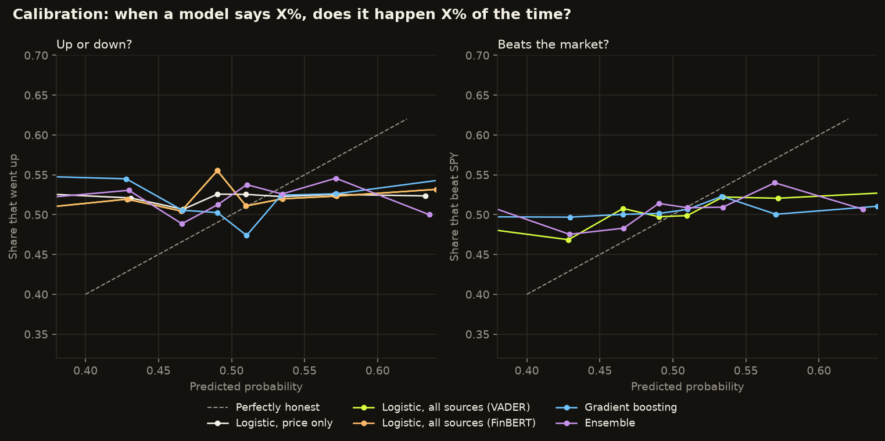

# Stock prediction lab: latest report

Generated 2026-09-25 00:39 UTC.

## Next-session calls

| Rank | Stock | P(up) | Call | P(beats SPY) | vs the market | Headlines (24 h) | Mood: VADER | Mood: FinBERT |
|---|---|---|---|---|---|---|---|---|
| 1 | JPM | **56.8%** | **Buy at open** | 61.0% | **Outperform** | 33 | positive (+0.17) | positive (+0.25) |
| 2 | XOM | **54.8%** | **Buy at open** | 60.4% | **Outperform** | 19 | neutral (+0.04) | positive (+0.09) |
| 3 | AMZN | **53.6%** | **Buy at open** | 50.2% | – | 80 | positive (+0.15) | negative (-0.08) |
| 4 | GOOGL | **50.8%** | Stay out | 48.4% | – | 62 | positive (+0.10) | neutral (+0.03) |
| 5 | AAPL | **50.3%** | Stay out | 56.2% | – | 55 | positive (+0.12) | neutral (+0.01) |
| 6 | UNH | **48.2%** | Stay out | 41.8% | – | 25 | positive (+0.19) | negative (-0.16) |
| 7 | NVDA | **47.9%** | Stay out | 44.3% | – | 101 | positive (+0.14) | negative (-0.06) |
| 8 | TSLA | **43.6%** | Stay out | 45.1% | – | 44 | positive (+0.11) | positive (+0.10) |
| 9 | MSFT | **42.8%** | Stay out | 56.4% | **Outperform** | 49 | neutral (+0.03) | neutral (+0.04) |
| 10 | META | **42.5%** | Stay out | 40.7% | – | 151 | positive (+0.15) | positive (+0.08) |

Every model's probability:

| Stock | P(up): logistic, price only | P(up): logistic, all sources (VADER) | P(up): logistic, all sources (FinBERT) | P(beats SPY): logistic, all sources (VADER) | P(up): gradient boosting | P(beats SPY): gradient boosting | P(up): ensemble | P(beats SPY): ensemble |
|---|---|---|---|---|---|---|---|---|
| AAPL | 52.1% | 50.1% | 50.1% | 56.2% | 50.5% | 50.2% | 50.3% | 53.2% |
| AMZN | 54.8% | 51.2% | 51.2% | 50.2% | 56.0% | 49.2% | 53.6% | 49.7% |
| GOOGL | 55.1% | 49.1% | 49.1% | 48.4% | 52.5% | 49.2% | 50.8% | 48.8% |
| JPM | 56.4% | 56.9% | 56.9% | 61.0% | 56.8% | 50.2% | 56.8% | 55.6% |
| META | 41.8% | 38.2% | 38.2% | 40.7% | 46.9% | 49.5% | 42.5% | 45.1% |
| MSFT | 53.1% | 38.4% | 38.4% | 56.4% | 47.2% | 50.5% | 42.8% | 53.4% |
| NVDA | 54.6% | 48.6% | 48.6% | 44.3% | 47.3% | 50.2% | 47.9% | 47.2% |
| TSLA | 42.3% | 40.7% | 40.7% | 45.1% | 46.5% | 50.2% | 43.6% | 47.7% |
| UNH | 48.4% | 40.4% | 40.4% | 41.8% | 56.1% | 49.7% | 48.2% | 45.8% |
| XOM | 57.8% | 61.5% | 61.5% | 60.4% | 48.1% | 50.7% | 54.8% | 55.6% |

## Accuracy: up or down?

| | Predictions | Accuracy | 95% range | Always up | Same as today | Beats baselines? | Brier |
|---|---|---|---|---|---|---|---|
| Historical replay, logistic, price only | 10,348 | **51.0%** | 50.0%–51.9% | 52.2% | 49.8% | no | 0.2523 |
| Historical replay, logistic, all sources (VADER) | 10,348 | **50.4%** | 49.4%–51.4% | 52.2% | 49.8% | no | 0.2544 |
| Historical replay, logistic, all sources (FinBERT) | 10,348 | **50.4%** | 49.4%–51.4% | 52.2% | 49.8% | no | 0.2544 |
| Historical replay, gradient boosting | 9,758 | **50.1%** | 49.1%–51.1% | 52.4% | 49.8% | no | 0.2592 |
| Historical replay, ensemble | 9,758 | **51.5%** | 50.5%–52.5% | 52.4% | 49.8% | no | 0.2533 |

## Accuracy: beats the market?

| | Predictions | Accuracy | 95% range | Always beats | Same as today | Beats baselines? | Brier |
|---|---|---|---|---|---|---|---|
| Historical replay, logistic, all sources (VADER) | 10,348 | **51.4%** | 50.4%–52.3% | 50.4% | 49.8% | within noise | 0.2542 |
| Historical replay, gradient boosting | 9,758 | **50.6%** | 49.6%–51.6% | 50.5% | 49.9% | within noise | 0.2544 |
| Historical replay, ensemble | 9,758 | **51.2%** | 50.2%–52.2% | 50.5% | 49.9% | within noise | 0.2520 |

*Brier* is the mean squared error of the probabilities (lower is better; always saying 50% scores 0.25).

## Calibration

Predictions grouped by confidence. For an honest model, the share that happened matches the prediction: of all the "55–60%" calls, about 57% should come true. *Average gap* is the weighted average distance between the two (expected calibration error). Uses live predictions once a model has 300, before that all scored ones.

**Up or down?**

| Predicted | Logistic, price only | Logistic, all sources (VADER) | Logistic, all sources (FinBERT) | Gradient boosting | Ensemble |
|---|---|---|---|---|---|
| under 40% | 52.8% (n=246) | 50.7% (n=603) | 50.7% (n=603) | 55.0% (n=1,049) | 52.0% (n=473) |
| 40–45% | 52.1% (n=789) | 52.0% (n=1,083) | 52.0% (n=1,083) | 54.5% (n=1,024) | 53.1% (n=919) |
| 45–48% | 50.7% (n=1,284) | 50.5% (n=1,236) | 50.5% (n=1,236) | 50.7% (n=1,093) | 49.0% (n=1,185) |
| 48–50% | 52.6% (n=1,305) | 55.6% (n=1,134) | 55.6% (n=1,134) | 50.3% (n=965) | 51.3% (n=1,139) |
| 50–52% | 52.5% (n=1,694) | 51.1% (n=1,236) | 51.1% (n=1,236) | 47.4% (n=1,091) | 53.7% (n=1,385) |
| 52–55% | 52.3% (n=2,299) | 52.0% (n=1,741) | 52.0% (n=1,741) | 52.5% (n=1,582) | 52.6% (n=1,973) |
| 55–60% | 52.6% (n=2,093) | 52.3% (n=2,085) | 52.3% (n=2,085) | 52.6% (n=1,532) | 54.6% (n=1,872) |
| 60% or more | 52.4% (n=638) | 53.2% (n=1,230) | 53.2% (n=1,230) | 54.9% (n=1,422) | 50.0% (n=812) |
| **Average gap** | **4.1 pts** | **5.5 pts** | **5.5 pts** | **7.1 pts** | **4.4 pts** |

**Beats the market?**

| Predicted | Logistic, all sources (VADER) | Gradient boosting | Ensemble |
|---|---|---|---|
| under 40% | 48.7% (n=927) | 49.7% (n=768) | 51.2% (n=426) |
| 40–45% | 47.0% (n=1,480) | 49.7% (n=1,260) | 47.6% (n=1,276) |
| 45–48% | 50.8% (n=1,429) | 50.1% (n=1,586) | 48.4% (n=1,674) |
| 48–50% | 49.7% (n=1,144) | 50.1% (n=1,382) | 51.4% (n=1,502) |
| 50–52% | 49.8% (n=1,184) | 50.6% (n=1,467) | 50.9% (n=1,450) |
| 52–55% | 52.2% (n=1,519) | 52.3% (n=1,571) | 50.9% (n=1,768) |
| 55–60% | 52.0% (n=1,657) | 50.0% (n=1,105) | 53.9% (n=1,291) |
| 60% or more | 52.7% (n=1,008) | 51.1% (n=619) | 50.7% (n=371) |
| **Average gap** | **4.7 pts** | **4.5 pts** | **3.2 pts** |

## Headline sentiment: VADER vs FinBERT

Every headline is scored by both. Two ways to compare them: the live accuracy of the two otherwise identical logistic models above (*all sources (VADER)* vs *all sources (FinBERT)*), and directly, below: does the mood predict the next session?

| Scorer | Stock-days with a clear mood | Mood matched the next session | Next-session return: positive mood | negative mood | Rank correlation with return |
|---|---|---|---|---|---|
| VADER | 0 | – | – | – | – |
| FinBERT | 0 | – | – | – | – |

The two scorers agree on the direction of the mood on 70% of 10 stock-days with headlines.

## Per stock: up or down?

Based on all scored (mostly historical replay) predictions.

| Stock | Sessions | Logistic, price only | Logistic, all sources (VADER) | Logistic, all sources (FinBERT) | Gradient boosting | Ensemble | Always up |
|---|---|---|---|---|---|---|---|
| AAPL | 1,035 | 51.3% | 49.4% | 49.4% | 48.7% | 50.5% | 54.4% |
| AMZN | 1,035 | 49.6% | 50.0% | 50.0% | 49.1% | 49.1% | 50.8% |
| GOOGL | 1,035 | 51.4% | 49.4% | 49.4% | 51.1% | 51.9% | 54.3% |
| JPM | 1,035 | 50.8% | 50.8% | 50.8% | 51.1% | 51.2% | 54.0% |
| META | 1,035 | 52.7% | 52.6% | 52.6% | 48.8% | 50.9% | 50.8% |
| MSFT | 1,035 | 51.8% | 52.1% | 52.1% | 49.9% | 52.3% | 51.9% |
| NVDA | 1,035 | 49.5% | 49.6% | 49.6% | 51.5% | 51.6% | 53.0% |
| TSLA | 1,035 | 53.1% | 53.2% | 53.2% | 49.8% | 52.7% | 49.9% |
| UNH | 1,034 | 50.2% | 48.7% | 48.7% | 49.7% | 52.1% | 51.4% |
| XOM | 1,034 | 49.3% | 48.3% | 48.3% | 51.6% | 52.8% | 51.8% |

## Per stock: beats the market?

Based on all scored (mostly historical replay) predictions.

| Stock | Sessions | Logistic, all sources (VADER) | Gradient boosting | Ensemble | Always beats |
|---|---|---|---|---|---|
| AAPL | 1,035 | 50.9% | 51.0% | 51.3% | 53.0% |
| AMZN | 1,035 | 49.2% | 52.7% | 50.7% | 47.8% |
| GOOGL | 1,035 | 49.9% | 51.3% | 50.6% | 53.5% |
| JPM | 1,035 | 52.7% | 49.0% | 49.9% | 53.4% |
| META | 1,035 | 51.2% | 48.2% | 50.1% | 49.1% |
| MSFT | 1,035 | 50.8% | 50.1% | 50.1% | 48.8% |
| NVDA | 1,035 | 51.9% | 52.5% | 52.8% | 52.4% |
| TSLA | 1,035 | 52.6% | 51.5% | 53.6% | 48.9% |
| UNH | 1,034 | 53.5% | 50.2% | 51.5% | 47.7% |
| XOM | 1,034 | 51.1% | 49.3% | 51.1% | 49.5% |

## Paper trading (simulated from prices)

Hypothetical: each session a strategy buys, at the open, the (up to) 3 stocks its model rates highest with P ≥ 52%, and sells them at the close, paying 5 bp per trade. The *beats the market* version also shorts the same amount of SPY, so it only earns the stocks' return above the market's (two trades, double cost).

**Up or down**

| Strategy | Sessions | Total return | Per year | Sharpe | Winning days |
|---|---|---|---|---|---|
| Top 3 by logistic, price only | 1,035 | +34.9% | +7.6% | 0.46 | 50.6% |
| Top 3 by logistic, all sources (VADER) | 1,035 | +33.4% | +7.3% | 0.46 | 50.0% |
| Top 3 by logistic, all sources (FinBERT) | 1,035 | +33.4% | +7.3% | 0.46 | 50.0% |
| Top 3 by gradient boosting | 976 | +68.3% | +14.4% | 0.79 | 37.0% |
| Top 3 by ensemble | 976 | +35.7% | +8.2% | 0.52 | 45.8% |
| Buy every stock, every session | 1,035 | +0.5% | +0.1% | 0.09 | 52.1% |

**Beats the market (market-neutral)**

| Strategy | Sessions | Total return | Per year | Sharpe | Winning days |
|---|---|---|---|---|---|
| Top 3 by logistic, all sources (VADER) | 1,035 | -25.3% | -6.9% | -0.43 | 46.7% |
| Top 3 by gradient boosting | 976 | -41.1% | -12.8% | -0.77 | 40.2% |
| Top 3 by ensemble | 976 | -16.5% | -4.5% | -0.22 | 46.1% |
| Every stock minus SPY | 1,035 | -52.8% | -16.7% | -2.37 | 42.3% |

## Paper orders at Alpaca (real fills)

No paper orders yet. Connect an Alpaca paper account (see the README) and the champion's picks are sent as real simulated orders every session.

## Data sources this run

| Source | Calls ok | Failed | Items | Note |
|---|---|---|---|---|
| alpaca | 0 | 0 | 0 | skipped: set ALPACA_API_KEY and ALPACA_SECRET_KEY to enable |
| analysts | 10 | 0 | 7669 |  |
| earnings | 10 | 0 | 500 |  |
| finbert | 8 | 0 | 22 |  |
| finnhub | 0 | 0 | 0 | skipped: set FINNHUB_API_KEY to enable |
| fred | 0 | 1 | 0 | ReadTimeout: HTTPSConnectionPool(host='fred.stlouisfed.org', port=443): Read timed out. (read timeout=20) |
| google_news | 10 | 0 | 994 |  |
| macro_yahoo | 1 | 0 | 1086 |  |
| prices | 11 | 0 | 11933 |  |
| reddit | 0 | 0 | 0 | skipped: set REDDIT_CLIENT_ID and REDDIT_CLIENT_SECRET to enable |
| sec_filings | 0 | 0 | 0 | skipped: set SEC_USER_AGENT to enable |
| yahoo_rss | 10 | 0 | 174 |  |

## This run, per stock

| Stock | Status | Data through | History replayed | Scored today | Headlines (24 h) |
|---|---|---|---|---|---|
| AAPL | ok | 2026-09-24 | 0 | 0 | 0 |
| MSFT | ok | 2026-09-24 | 0 | 0 | 0 |
| NVDA | ok | 2026-09-24 | 0 | 0 | 0 |
| AMZN | ok | 2026-09-24 | 0 | 0 | 0 |
| GOOGL | ok | 2026-09-24 | 0 | 0 | 0 |
| META | ok | 2026-09-24 | 0 | 0 | 0 |
| TSLA | ok | 2026-09-24 | 0 | 0 | 0 |
| JPM | ok | 2026-09-24 | 0 | 0 | 0 |
| XOM | ok | 2026-09-24 | 0 | 0 | 0 |
| UNH | ok | 2026-09-24 | 0 | 0 | 0 |

---

Educational project. Not financial advice.
