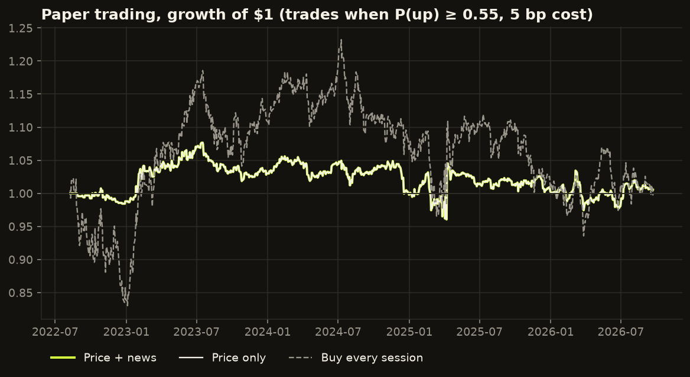

# Stock prediction lab: latest report

Generated 2026-09-24 14:31 UTC.

## Next-session calls

| Stock | P(up), price + news | P(up), price only | Call | Headlines (24 h) | News mood |
|---|---|---|---|---|---|
| AAPL | 50.9% | 50.9% | Stay out | 32 | positive (+0.09) |
| AMZN | 52.8% | 52.8% | Stay out | 42 | positive (+0.16) |
| GOOGL | 54.3% | 54.3% | Stay out | 44 | positive (+0.07) |
| JPM | 55.5% | 55.5% | **Buy at open** | 21 | positive (+0.15) |
| META | 37.9% | 37.9% | Stay out | 72 | positive (+0.11) |
| MSFT | 53.2% | 53.2% | Stay out | 27 | positive (+0.12) |
| NVDA | 54.0% | 54.0% | Stay out | 64 | positive (+0.14) |
| TSLA | 46.2% | 46.2% | Stay out | 21 | positive (+0.07) |
| UNH | 51.3% | 51.3% | Stay out | 15 | positive (+0.10) |
| XOM | 52.0% | 52.0% | Stay out | 22 | positive (+0.16) |

## Accuracy

| | Predictions | Accuracy | 95% range | Always up | Same as today | Beats baselines? |
|---|---|---|---|---|---|---|
| Historical replay, price + news | 10,338 | **51.0%** | 50.0%–51.9% | 52.2% | 49.8% | no |
| Historical replay, price only | 10,338 | **51.0%** | 50.0%–51.9% | 52.2% | 49.8% | no |

## Per stock

Based on all resolved (mostly historical replay) predictions.

| Stock | Predictions | Price + news | Price only | Always up |
|---|---|---|---|---|
| AAPL | 1,034 | 51.4% | 51.4% | 54.4% |
| AMZN | 1,034 | 49.5% | 49.5% | 50.8% |
| GOOGL | 1,034 | 51.4% | 51.4% | 54.3% |
| JPM | 1,034 | 50.8% | 50.8% | 54.0% |
| META | 1,034 | 52.7% | 52.7% | 50.8% |
| MSFT | 1,034 | 51.7% | 51.7% | 51.8% |
| NVDA | 1,034 | 49.4% | 49.4% | 53.0% |
| TSLA | 1,034 | 53.2% | 53.2% | 49.8% |
| UNH | 1,033 | 50.1% | 50.1% | 51.3% |
| XOM | 1,033 | 49.4% | 49.4% | 51.9% |

## Paper trading

Hypothetical only: no real orders are placed.

## Data sources this run

| Source | Calls ok | Failed | Items | Note |
|---|---|---|---|---|
| finnhub | 0 | 0 | 0 | skipped: set FINNHUB_API_KEY to enable |
| google_news | 10 | 0 | 1001 |  |
| prices | 11 | 0 | 11933 |  |
| sec_filings | 0 | 0 | 0 | skipped: set SEC_USER_AGENT to enable |
| yahoo_rss | 10 | 0 | 187 |  |

## This run, per stock

| Stock | Status | Data through | History replayed | Scored today | Headlines (24 h) |
|---|---|---|---|---|---|
| AAPL | ok | 2026-09-23 | 1034 | 0 | 32 |
| MSFT | ok | 2026-09-23 | 1034 | 0 | 27 |
| NVDA | ok | 2026-09-23 | 1034 | 0 | 64 |
| AMZN | ok | 2026-09-23 | 1034 | 0 | 42 |
| GOOGL | ok | 2026-09-23 | 1034 | 0 | 44 |
| META | ok | 2026-09-23 | 1034 | 0 | 72 |
| TSLA | ok | 2026-09-23 | 1034 | 0 | 21 |
| JPM | ok | 2026-09-23 | 1034 | 0 | 21 |
| XOM | ok | 2026-09-23 | 1033 | 0 | 22 |
| UNH | ok | 2026-09-23 | 1033 | 0 | 15 |

---

Educational project. Not financial advice.
