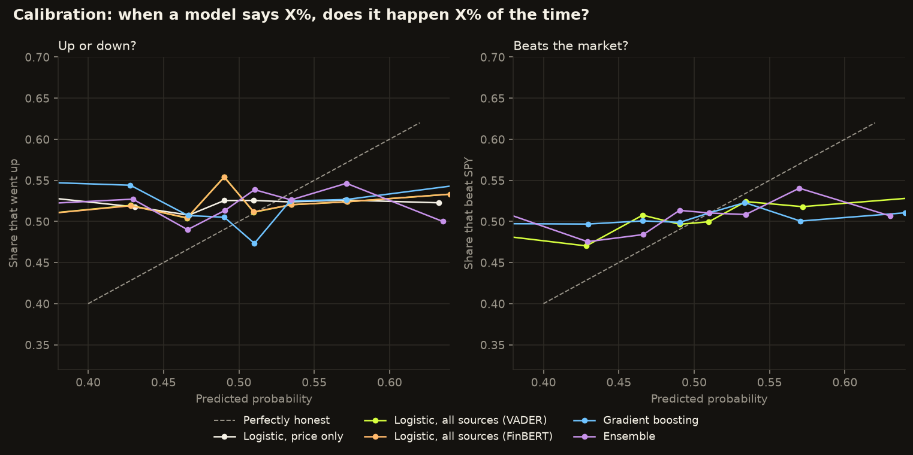
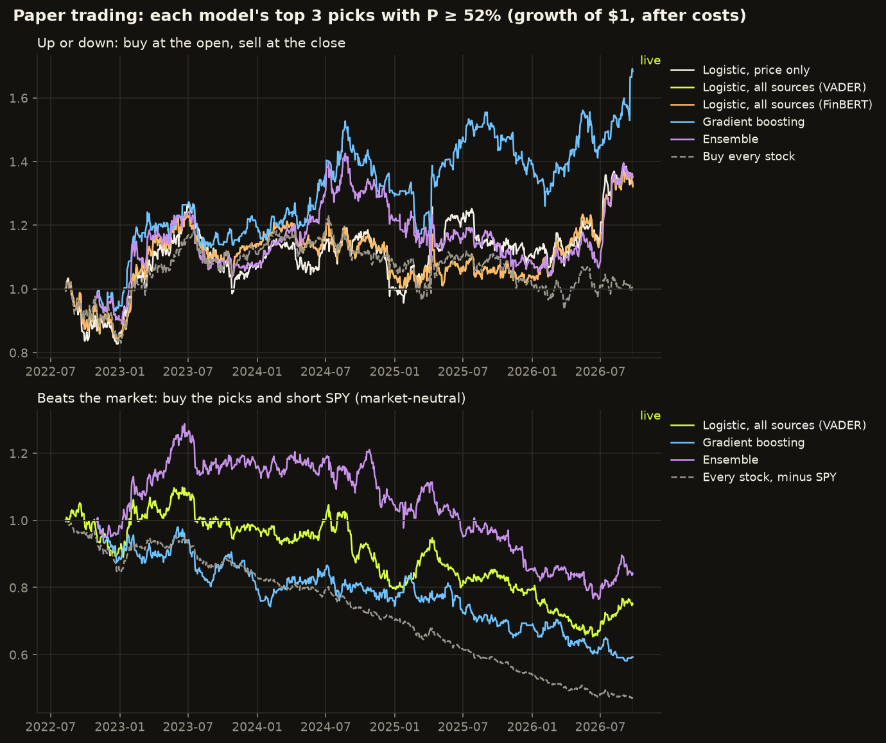

# Stock prediction lab: latest report

Generated 2026-10-08 07:24 UTC.

## Next-session calls

| Rank | Stock | P(up) | Call | P(beats SPY) | vs the market | Headlines (24 h) | Mood: VADER | Mood: FinBERT |
|---|---|---|---|---|---|---|---|---|
| 1 | XOM | **59.8%** | **Buy at open** | 64.4% | **Outperform** | 19 | positive (+0.23) | positive (+0.33) |
| 2 | JPM | **53.6%** | **Buy at open** | 58.4% | **Outperform** | 20 | positive (+0.09) | positive (+0.10) |
| 3 | GOOGL | **52.5%** | **Buy at open** | 51.7% | – | 32 | positive (+0.15) | positive (+0.12) |
| 4 | AAPL | **51.9%** | Stay out | 53.1% | **Outperform** | 28 | positive (+0.12) | positive (+0.15) |
| 5 | AMZN | **50.5%** | Stay out | 50.7% | – | 45 | positive (+0.17) | positive (+0.12) |
| 6 | UNH | **49.4%** | Stay out | 35.7% | – | 5 | neutral (-0.02) | negative (-0.06) |
| 7 | NVDA | **46.8%** | Stay out | 43.5% | – | 91 | positive (+0.09) | neutral (+0.05) |
| 8 | META | **46.5%** | Stay out | 50.0% | – | 48 | positive (+0.16) | positive (+0.07) |
| 9 | MSFT | **46.0%** | Stay out | 52.4% | – | 28 | positive (+0.12) | positive (+0.27) |
| 10 | TSLA | **42.2%** | Stay out | 41.3% | – | 21 | positive (+0.20) | neutral (+0.02) |

Every model's probability:

| Stock | P(up): logistic, price only | P(up): logistic, all sources (VADER) | P(up): logistic, all sources (FinBERT) | P(beats SPY): logistic, all sources (VADER) | P(up): gradient boosting | P(beats SPY): gradient boosting | P(up): ensemble | P(beats SPY): ensemble |
|---|---|---|---|---|---|---|---|---|
| AAPL | 55.0% | 55.6% | 54.6% | 53.1% | 48.2% | 49.0% | 51.9% | 51.0% |
| AMZN | 52.2% | 53.4% | 53.8% | 50.7% | 47.7% | 47.3% | 50.5% | 49.0% |
| GOOGL | 53.4% | 54.6% | 55.3% | 51.7% | 50.5% | 49.5% | 52.5% | 50.6% |
| JPM | 52.7% | 54.3% | 54.2% | 58.4% | 52.9% | 51.0% | 53.6% | 54.7% |
| META | 48.9% | 44.4% | 44.6% | 50.0% | 48.5% | 49.8% | 46.5% | 49.9% |
| MSFT | 55.3% | 44.3% | 43.5% | 52.4% | 47.6% | 51.3% | 46.0% | 51.8% |
| NVDA | 49.6% | 44.5% | 43.6% | 43.5% | 49.0% | 50.0% | 46.8% | 46.8% |
| TSLA | 42.5% | 38.6% | 37.8% | 41.3% | 45.9% | 47.6% | 42.2% | 44.5% |
| UNH | 48.9% | 48.2% | 48.8% | 35.7% | 50.6% | 50.3% | 49.4% | 43.0% |
| XOM | 59.3% | 69.7% | 71.8% | 64.4% | 49.9% | 49.8% | 59.8% | 57.1% |

## Accuracy: up or down?

| | Predictions | Accuracy | 95% range | Always up | Same as today | Beats baselines? | Brier |
|---|---|---|---|---|---|---|---|
| Live, logistic, price only | 90 | **55.6%** | 45.3%–65.8% | 51.1% | 55.6% | no | 0.2472 |
| Live, logistic, all sources (VADER) | 90 | **58.9%** | 48.7%–69.1% | 51.1% | 55.6% | within noise | 0.2455 |
| Live, logistic, all sources (FinBERT) | 90 | **60.0%** | 49.9%–70.1% | 51.1% | 55.6% | within noise | 0.2451 |
| Live, gradient boosting | 90 | **47.8%** | 37.5%–58.1% | 51.1% | 55.6% | no | 0.2491 |
| Live, ensemble | 90 | **56.7%** | 46.4%–66.9% | 51.1% | 55.6% | within noise | 0.2455 |
| Historical replay, logistic, price only | 10,348 | **51.0%** | 50.0%–51.9% | 52.2% | 49.8% | no | 0.2523 |
| Historical replay, logistic, all sources (VADER) | 10,348 | **50.4%** | 49.4%–51.4% | 52.2% | 49.8% | no | 0.2544 |
| Historical replay, logistic, all sources (FinBERT) | 10,348 | **50.4%** | 49.4%–51.4% | 52.2% | 49.8% | no | 0.2544 |
| Historical replay, gradient boosting | 9,758 | **50.1%** | 49.1%–51.1% | 52.4% | 49.8% | no | 0.2592 |
| Historical replay, ensemble | 9,758 | **51.5%** | 50.5%–52.5% | 52.4% | 49.8% | no | 0.2533 |

## Accuracy: beats the market?

| | Predictions | Accuracy | 95% range | Always beats | Same as today | Beats baselines? | Brier |
|---|---|---|---|---|---|---|---|
| Live, logistic, all sources (VADER) | 90 | **58.9%** | 48.7%–69.1% | 50.0% | 47.8% | within noise | 0.2507 |
| Live, gradient boosting | 90 | **61.1%** | 51.0%–71.2% | 50.0% | 47.8% | yes | 0.2488 |
| Live, ensemble | 90 | **54.4%** | 44.2%–64.7% | 50.0% | 47.8% | within noise | 0.2485 |
| Historical replay, logistic, all sources (VADER) | 10,348 | **51.4%** | 50.4%–52.3% | 50.4% | 49.8% | within noise | 0.2542 |
| Historical replay, gradient boosting | 9,758 | **50.6%** | 49.6%–51.6% | 50.5% | 49.9% | within noise | 0.2544 |
| Historical replay, ensemble | 9,758 | **51.2%** | 50.2%–52.2% | 50.5% | 49.9% | within noise | 0.2520 |

*Brier* is the mean squared error of the probabilities (lower is better; always saying 50% scores 0.25).

## Calibration

Predictions grouped by confidence. For an honest model, the share that happened matches the prediction: of all the "55–60%" calls, about 57% should come true. *Average gap* is the weighted average distance between the two (expected calibration error). Uses live predictions once a model has 300, before that all scored ones.

**Up or down?**

| Predicted | Logistic, price only | Logistic, all sources (VADER) | Logistic, all sources (FinBERT) | Gradient boosting | Ensemble |
|---|---|---|---|---|---|
| under 40% | 53.0% (n=247) | 50.6% (n=616) | 50.6% (n=618) | 55.0% (n=1,049) | 52.1% (n=474) |
| 40–45% | 51.7% (n=795) | 51.8% (n=1,105) | 51.7% (n=1,104) | 54.2% (n=1,040) | 52.5% (n=944) |
| 45–48% | 50.8% (n=1,294) | 50.5% (n=1,246) | 50.5% (n=1,247) | 50.8% (n=1,119) | 49.0% (n=1,201) |
| 48–50% | 52.5% (n=1,318) | 55.4% (n=1,144) | 55.4% (n=1,143) | 50.5% (n=986) | 51.4% (n=1,154) |
| 50–52% | 52.6% (n=1,706) | 51.1% (n=1,248) | 51.2% (n=1,247) | 47.3% (n=1,105) | 53.9% (n=1,400) |
| 52–55% | 52.3% (n=2,321) | 52.1% (n=1,749) | 52.1% (n=1,748) | 52.5% (n=1,589) | 52.6% (n=1,986) |
| 55–60% | 52.6% (n=2,118) | 52.4% (n=2,093) | 52.4% (n=2,094) | 52.7% (n=1,538) | 54.6% (n=1,877) |
| 60% or more | 52.3% (n=639) | 53.3% (n=1,237) | 53.3% (n=1,237) | 54.9% (n=1,422) | 50.0% (n=812) |
| **Average gap** | **4.1 pts** | **5.5 pts** | **5.5 pts** | **7.1 pts** | **4.4 pts** |

**Beats the market?**

| Predicted | Logistic, all sources (VADER) | Gradient boosting | Ensemble |
|---|---|---|---|
| under 40% | 48.6% (n=930) | 49.7% (n=768) | 51.2% (n=426) |
| 40–45% | 47.0% (n=1,497) | 49.7% (n=1,260) | 47.5% (n=1,279) |
| 45–48% | 50.7% (n=1,444) | 50.0% (n=1,589) | 48.3% (n=1,695) |
| 48–50% | 49.6% (n=1,155) | 49.8% (n=1,419) | 51.4% (n=1,524) |
| 50–52% | 50.1% (n=1,190) | 51.0% (n=1,515) | 51.0% (n=1,464) |
| 52–55% | 52.4% (n=1,534) | 52.3% (n=1,573) | 50.8% (n=1,789) |
| 55–60% | 51.8% (n=1,671) | 50.0% (n=1,105) | 54.0% (n=1,300) |
| 60% or more | 52.8% (n=1,017) | 51.1% (n=619) | 50.7% (n=371) |
| **Average gap** | **4.6 pts** | **4.4 pts** | **3.2 pts** |

## Headline sentiment: VADER vs FinBERT

Every headline is scored by both. Two ways to compare them: the live accuracy of the two otherwise identical logistic models above (*all sources (VADER)* vs *all sources (FinBERT)*), and directly, below: does the mood predict the next session?

| Scorer | Stock-days with a clear mood | Mood matched the next session | Next-session return: positive mood | negative mood | Rank correlation with return |
|---|---|---|---|---|---|
| VADER | 81 | 48.1% | -0.1% | 0.1% | -0.067 |
| FinBERT | 56 | 51.8% | -0.1% | 0.5% | -0.053 |

The two scorers agree on the direction of the mood on 71% of 100 stock-days with headlines.

## Per stock: up or down?

Based on all scored (mostly historical replay) predictions.

| Stock | Sessions | Logistic, price only | Logistic, all sources (VADER) | Logistic, all sources (FinBERT) | Gradient boosting | Ensemble | Always up |
|---|---|---|---|---|---|---|---|
| AAPL | 1,044 | 51.4% | 49.5% | 49.5% | 48.5% | 50.5% | 54.5% |
| AMZN | 1,044 | 49.7% | 50.2% | 50.2% | 49.0% | 49.0% | 51.0% |
| GOOGL | 1,044 | 51.5% | 49.4% | 49.4% | 51.1% | 52.2% | 54.4% |
| JPM | 1,044 | 50.7% | 50.7% | 50.8% | 50.9% | 51.0% | 53.8% |
| META | 1,044 | 52.9% | 52.8% | 52.8% | 49.1% | 51.2% | 50.6% |
| MSFT | 1,044 | 51.6% | 52.0% | 52.0% | 49.8% | 52.2% | 51.9% |
| NVDA | 1,044 | 49.4% | 49.8% | 49.8% | 51.7% | 51.9% | 52.8% |
| TSLA | 1,044 | 53.1% | 53.3% | 53.3% | 49.8% | 52.7% | 49.7% |
| UNH | 1,043 | 50.1% | 48.5% | 48.5% | 49.9% | 52.0% | 51.5% |
| XOM | 1,043 | 49.6% | 48.5% | 48.5% | 51.2% | 53.0% | 52.1% |

## Per stock: beats the market?

Based on all scored (mostly historical replay) predictions.

| Stock | Sessions | Logistic, all sources (VADER) | Gradient boosting | Ensemble | Always beats |
|---|---|---|---|---|---|
| AAPL | 1,044 | 51.1% | 51.1% | 51.5% | 53.1% |
| AMZN | 1,044 | 49.2% | 52.7% | 50.6% | 48.1% |
| GOOGL | 1,044 | 50.0% | 51.6% | 50.7% | 53.6% |
| JPM | 1,044 | 52.5% | 48.9% | 49.7% | 53.3% |
| META | 1,044 | 51.3% | 48.2% | 50.1% | 48.9% |
| MSFT | 1,044 | 51.1% | 50.4% | 50.4% | 48.9% |
| NVDA | 1,044 | 52.0% | 52.5% | 52.9% | 52.2% |
| TSLA | 1,044 | 52.6% | 51.5% | 53.6% | 48.8% |
| UNH | 1,043 | 53.3% | 50.4% | 51.4% | 47.7% |
| XOM | 1,043 | 51.2% | 49.5% | 51.2% | 49.7% |

## Paper trading (simulated from prices)

Hypothetical: each session a strategy buys, at the open, the (up to) 3 stocks its model rates highest with P ≥ 52%, and sells them at the close, paying 5 bp per trade. The *beats the market* version also shorts the same amount of SPY, so it only earns the stocks' return above the market's (two trades, double cost).

**Up or down**

| Strategy | Sessions | Total return | Per year | Sharpe | Winning days |
|---|---|---|---|---|---|
| Top 3 by logistic, price only | 1,044 | +37.1% | +7.9% | 0.47 | 50.8% |
| Top 3 by logistic, all sources (VADER) | 1,044 | +34.3% | +7.4% | 0.47 | 50.1% |
| Top 3 by logistic, all sources (FinBERT) | 1,044 | +34.3% | +7.4% | 0.47 | 50.1% |
| Top 3 by gradient boosting | 985 | +67.1% | +14.0% | 0.77 | 36.9% |
| Top 3 by ensemble | 985 | +35.5% | +8.1% | 0.52 | 45.9% |
| Buy every stock, every session | 1,044 | -0.4% | -0.1% | 0.08 | 51.9% |

**Beats the market (market-neutral)**

| Strategy | Sessions | Total return | Per year | Sharpe | Winning days |
|---|---|---|---|---|---|
| Top 3 by logistic, all sources (VADER) | 1,044 | -25.0% | -6.7% | -0.42 | 46.8% |
| Top 3 by gradient boosting | 985 | -42.9% | -13.4% | -0.82 | 39.8% |
| Top 3 by ensemble | 985 | -16.1% | -4.4% | -0.21 | 46.3% |
| Every stock minus SPY | 1,044 | -53.3% | -16.8% | -2.39 | 42.2% |

## Paper orders at Alpaca (real fills)

No paper orders yet. Connect an Alpaca paper account (see the README) and the champion's picks are sent as real simulated orders every session.

## Data sources this run

| Source | Calls ok | Failed | Items | Note |
|---|---|---|---|---|
| alpaca | 0 | 0 | 0 | skipped: set ALPACA_API_KEY and ALPACA_SECRET_KEY to enable |
| analysts | 10 | 0 | 7678 |  |
| earnings | 10 | 0 | 500 |  |
| finbert | 10 | 0 | 86 |  |
| finnhub | 0 | 0 | 0 | skipped: set FINNHUB_API_KEY to enable |
| fred | 0 | 1 | 0 | ReadTimeout: HTTPSConnectionPool(host='fred.stlouisfed.org', port=443): Read timed out. (read timeout=20) |
| google_news | 10 | 0 | 1002 |  |
| macro_yahoo | 1 | 0 | 1087 |  |
| prices | 11 | 0 | 11935 |  |
| reddit | 0 | 0 | 0 | skipped: set REDDIT_CLIENT_ID and REDDIT_CLIENT_SECRET to enable |
| sec_filings | 0 | 0 | 0 | skipped: set SEC_USER_AGENT to enable |
| yahoo_rss | 10 | 0 | 167 |  |

## This run, per stock

| Stock | Status | Data through | History replayed | Scored today | Headlines (24 h) |
|---|---|---|---|---|---|
| AAPL | ok | 2026-10-07 | 0 | 0 | 0 |
| MSFT | ok | 2026-10-07 | 0 | 0 | 0 |
| NVDA | ok | 2026-10-07 | 0 | 0 | 0 |
| AMZN | ok | 2026-10-07 | 0 | 0 | 0 |
| GOOGL | ok | 2026-10-07 | 0 | 0 | 0 |
| META | ok | 2026-10-07 | 0 | 0 | 0 |
| TSLA | ok | 2026-10-07 | 0 | 0 | 0 |
| JPM | ok | 2026-10-07 | 0 | 0 | 0 |
| XOM | ok | 2026-10-07 | 0 | 0 | 0 |
| UNH | ok | 2026-10-07 | 0 | 0 | 0 |

---

Educational project. Not financial advice.
